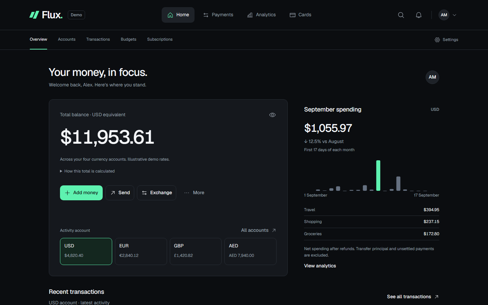
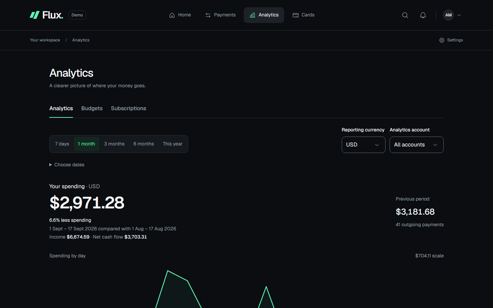
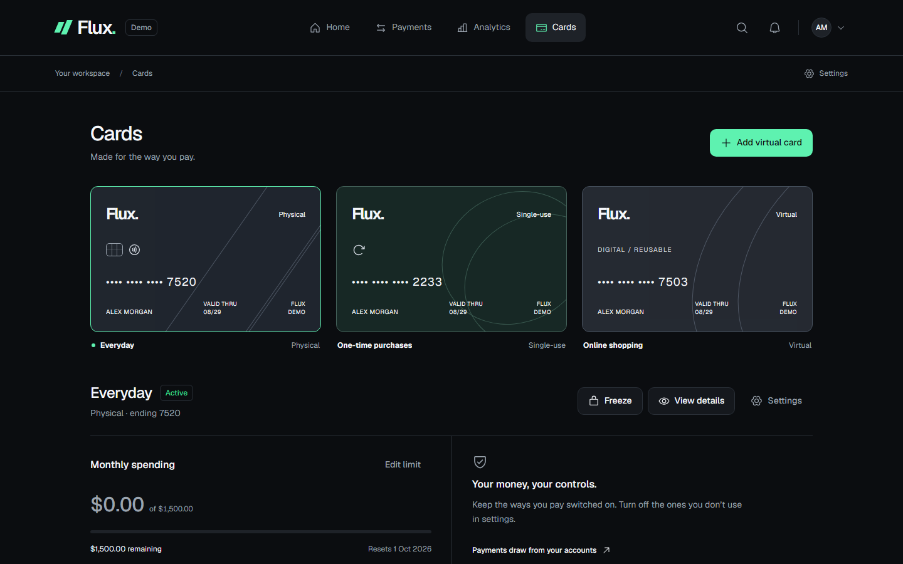
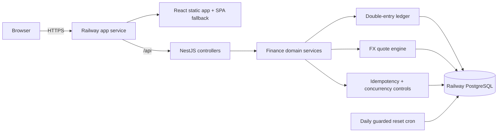

# Flux

A full-stack multi-currency fintech banking platform demonstrating modern frontend engineering and production-oriented financial workflows.

[**Try the live demo →**](https://flux-api-production-be4f.up.railway.app/login) · No credentials required · [Health check](https://flux-api-production-be4f.up.railway.app/health)

> Flux uses fictional people, accounts, cards, merchants, and simulated funds. It does not connect to banks or move real money.



## Product tour

| Home                                                                  | Analytics                                                                 | Cards                                                                                 |
| --------------------------------------------------------------------- | ------------------------------------------------------------------------- | ------------------------------------------------------------------------------------- |
| Four currency accounts, net worth, recent activity, and quick actions | Period comparisons, cash flow, spending trends, categories, and merchants | Physical, reusable virtual, and single-use cards with controls and secure demo reveal |
|                                |                          |                                              |

Select **Try Demo** on the sign-in screen to enter the seeded portfolio immediately. A useful five-minute review is:

1. Check the four-currency overview on **Home**.
2. Send a quoted EUR payment from the USD account on **Payments**.
3. Review the balanced account and transaction entries.
4. Inspect card controls and the simulated secure reveal on **Cards**.
5. Compare trends on **Analytics**, then review **Budgets** and **Subscriptions**.

## What it demonstrates

- Multi-currency USD, EUR, GBP, and AED accounts with consistent minor-unit arithmetic.
- Searchable transaction history, editable categories, responsive account views, and route-level recovery.
- FX quotes with explicit fees, 45-second expiry, concurrency protection, and idempotent execution.
- Double-entry ledger journals that reconcile to zero by currency.
- Card lifecycle controls, encrypted synthetic credentials, authorization, refunds, and audit history.
- Derived analytics, monthly budgets, recurring-payment detection, and subscription tracking.
- Accessible keyboard flows, mobile layouts, reduced motion support, safe error states, and request IDs.

## Stack

| Layer      | Technology                                                                             |
| ---------- | -------------------------------------------------------------------------------------- |
| Frontend   | React 19, TypeScript, Redux Toolkit Query, React Router, Webpack                       |
| Interface  | CSS design system, Radix primitives, Phosphor icons, Geist variable font               |
| Backend    | NestJS 11, class-validator, Node.js 24                                                 |
| Data       | PostgreSQL 18 on Railway, Prisma 7 migrations and typed client                         |
| Quality    | Jest, Testing Library, Supertest, Cypress, Playwright, axe-core                        |
| Production | Railway HTTPS app, PostgreSQL service, health checks, daily reset cron, GitHub Actions |

## Production architecture



The browser and API share one HTTPS origin, so the HttpOnly demo session remains first-party. Railway checks `GET /health` before routing traffic. Migrations and the idempotent seed run before each app release. A separate scheduled service restores the canonical demo in one PostgreSQL transaction each day.

## Engineering highlights

Financial writes run inside database transactions and lock the affected account records. A unique user/idempotency key pair makes a retry return the original result, while a request hash rejects accidental key reuse with different inputs. Every completed transfer or card event posts equal and opposite ledger entries per currency.

The API exposes safe public errors with a request ID and keeps internal detail in structured server logs. Production logs record method, path, status, duration, and request ID without bodies, cookies, card data, or database credentials. Synthetic card numbers and CVVs are encrypted at rest and are never placed in Redux, browser storage, logs, or ordinary API responses.

The production bundle uses same-origin `/api` requests. Direct routes such as `/analytics`, `/cards`, and `/subscriptions` return the app shell, while missing API routes remain JSON 404 responses. Hashed assets receive immutable caching and the HTML shell is served with `no-store`.

## Run locally

Requirements: Node.js 24.15+, npm 11.12.1+ on the npm 11 line, and Docker with Compose v2 or PostgreSQL 17+.

```sh
npm install
npm run setup
npm run db:up
npm run db:deploy
npm run db:seed
npm run dev
```

Open [localhost:3000](http://localhost:3000). `npm run setup` creates an ignored `.env` with a random local database password and synthetic-card encryption key. The API deliberately fails startup when PostgreSQL is unavailable or required configuration is invalid.

Windows users with PostgreSQL 17 installed can use the isolated local cluster helper instead of Docker:

```powershell
npm install
npm run setup
.\scripts\postgres-local.ps1 start
npm run db:deploy
npm run db:seed
npm run dev
```

## Verification

```sh
npm run check
npm run test:integration
npm run test:e2e
npm run test:production
```

The production verifier creates a random temporary database, applies all committed migrations, seeds the baseline, proves the reset guard rejects unauthorized execution, restores 444 transactions, reconciles every ledger currency to zero, starts the compiled app, checks eight SPA deep links, creates a secure session, reads all four accounts, validates safe 404s, scans the browser bundle for server secrets, and drops only its generated database.

The broader suite includes 114 API unit tests, 116 web tests, real PostgreSQL integration coverage, 20 isolated Cypress journeys, six responsive breakpoints, axe checks, keyboard flows, failure recovery, and 5,000-row history stress tests.

## Production operations

The app service builds both workspaces, runs committed migrations and the idempotent seed before release, starts the compiled NestJS server, and exposes `/health`. Railway injects `PORT`; the server binds on all interfaces and trusts one provider proxy hop for secure cookies.

The reset service has no public domain. Its daily UTC schedule runs `npm run demo:reset` with an explicit guard value. It takes a transaction-scoped advisory lock, truncates application tables without touching migration history, recreates the canonical data, and commits atomically.

Server secrets live only in Railway variables:

| Variable                                         | Purpose                                                        |
| ------------------------------------------------ | -------------------------------------------------------------- |
| `DATABASE_URL`                                   | PostgreSQL connection for the API, migrations, seed, and reset |
| `CARD_ENCRYPTION_KEY`                            | 32-byte hex key for synthetic card credentials                 |
| `FRONTEND_URL`                                   | Exact HTTPS origin accepted by CORS and mutation origin checks |
| `NODE_ENV`, `SERVE_FRONTEND`, `WEB_API_BASE_URL` | Production runtime and same-origin hosting configuration       |
| `ALLOW_DEMO_RESET`                               | Exact guard required only by the scheduled reset service       |

For implementation detail, see the [architecture guide](docs/architecture.md), [transfers and ledger](docs/transfers-and-ledger.md), [cards and card payments](docs/cards.md), [analytics and planning](docs/insights.md), and [production operations](docs/operations.md).
